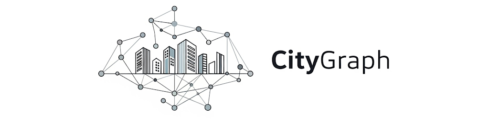

# 🏙️ CityGraph 

Projeto desenvolvido para a disciplina de **Estrutura de Dados II**, focado na modelagem e gerenciamento de estruturas urbanas, visando encontrar caminhos otimizados ligando um ponto a outro.


## 📜 Descrição

O programa modela uma cidade através de formas que representam diferentes elementos urbanos como quarteirões, ruas, pontos/coordenadas e textos informativos. As formas são lidas de arquivos `.geo` e organizadas em uma estrutura SmuTreap otimizada para consultas espaciais. 

O sistema processa consultas de arquivos `.qry` que podem realizar:

- **Consultas espaciais** — Busca de elementos em regiões específicas
- **Modificações geométricas** — Alterações em formas e estruturas  
- **Operações urbanas** — Alagamentos (`alag`), percursos (`perc`), junções (`join`) e outras operações de planejamento urbano
- **Análise de conectividade** — Processamento de vias e rotas através de arquivos `.via`

Os resultados são gerados em:

- **Arquivos de texto** (`.txt`) — Relatórios detalhados das operações
- **Visualizações gráficas** (`.svg`) — Representação visual da cidade e operações
- **Estrutura da árvore** (`.dot`) — Visualização da SmuTreap em formato Graphviz


## ⚙️ Tecnologias Utilizadas

- **C (C99)** — Linguagem principal de desenvolvimento  
- **Makefile** — Automação da compilação  
- **SVG** — Visualização gráfica das formas e operações  


## 🚀 Como Executar

### Pré-requisitos

- GCC (compilador C)
- `make` instalado

### Passos

1. Clone o repositório:
   ```bash
   git clone <URL_DO_REPOSITORIO>
   cd CityGraph
   ```

2. Compile o projeto:
   ```bash
   make
   ```

3. Execute com os parâmetros desejados:
   ```bash
   ./ted -e ./input/t2 -f c1.geo -v c1-v.via -q c1/00-perc-smpl.qry -o ./result
   ```

4. Ou use os targets pré-configurados:
   ```bash
   make c1    # Executa todos os testes do conjunto c1
   make c2    # Executa todos os testes do conjunto c2
   ```

### Parâmetros

| Parâmetro | Descrição                                                                 |
|-----------|---------------------------------------------------------------------------|
| `-e`      | Diretório base de entrada                                                 |
| `-f`      | Arquivo `.geo` com a descrição das formas geométricas                     |
| `-v`      | Arquivo `.via` com as definições de vias e conectividade (opcional)       |
| `-q`      | Arquivo `.qry` com as consultas e operações (opcional)                    |
| `-o`      | Diretório de saída para os arquivos gerados (`.svg`, `.txt`, `.dot`)      |


## 🏙️ Funcionalidades

- **� Estrutura SmuTreap**  
  Árvore de prioridade espacial com bounding boxes para otimização de buscas e promoção dinâmica de nós

- **🗺️ Consultas Espaciais**  
  Seleção eficiente de formas geométricas dentro de regiões retangulares específicas

- **🏗️ Modelagem Urbana**  
  Representação de quarteirões, ruas, pontos de interesse e elementos urbanos através de formas geométricas

- **🚦 Operações Urbanas**  
  Simulação de diferentes cenários urbanos:  
  `alag` (alagamentos), `perc` (percursos), `join` (junções), `dren` (drenagem), entre outros

- **�️ Sistema de Vias**  
  Processamento de conectividade entre elementos urbanos através de arquivos `.via`

- **📊 Visualização Gráfica**  
  Geração de arquivos `.svg` representando o mapa da cidade antes e depois das operações


## 📄 Tipos de Arquivos

### Arquivos de Entrada

- **`.geo`** — Define as formas geométricas que compõem a cidade (quarteirões, ruas, pontos de interesse)
- **`.via`** — Especifica as vias e conectividade entre elementos urbanos  
- **`.qry`** — Contém consultas e operações a serem executadas sobre a cidade

### Arquivos de Saída

- **`.txt`** — Relatórios textuais detalhados das operações executadas
- **`.svg`** — Visualizações gráficas da cidade e resultados das operações
- **`.dot`** — Estrutura da SmuTreap em formato Graphviz para análise


## 📁 Estrutura do Projeto

```
CityGraph/
│
├── src/                    # Código-fonte
│   ├── main.c             # Programa principal
│   ├── city/              # Estruturas urbanas (quarteirões, ruas, pontos)
│   ├── data_structures/   # Estruturas de dados (SmuTreap, lista, hash, etc.)
│   ├── forms/             # Formas geométricas (círculo, retângulo, linha, texto)
│   ├── processors/        # Processadores (args, geo, qry, svg, vias)
│   └── utils/             # Utilitários (manipulação de arquivos)
│
├── input/                 # Arquivos de entrada
│   └── t2/               # Conjunto de testes
│       ├── c1.geo        # Geometria da cidade 1
│       ├── c1-v.via      # Vias da cidade 1
│       ├── c1/           # Consultas da cidade 1
│       ├── c2.geo        # Geometria da cidade 2
│       ├── c2-v.via      # Vias da cidade 2
│       └── c2/           # Consultas da cidade 2
│
├── output/               # Arquivos objeto da compilação
├── result/               # Saída gerada (.txt, .svg, .dot)
├── Makefile             # Automação da compilação
└── README.md            # Documentação do projeto
```